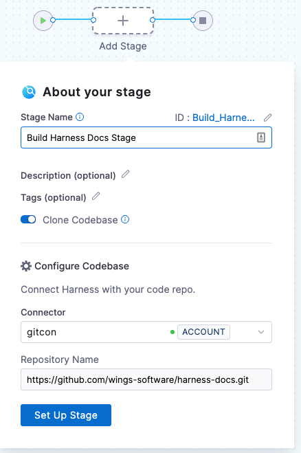
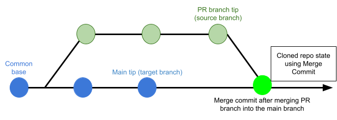
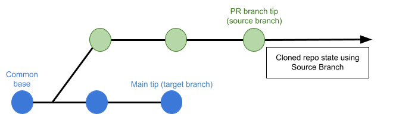

Each CI Pipeline has a Codebase that specifies the code repo (input) that the Pipeline uses to build the artifact (output). You specify the Codebase when you add the first Build Stage to the Pipeline. This becomes the default input for all other Stages in the Pipeline. By default, a Build Stage clones the repo from your Git provider into your build infrastructure when the Pipeline runs.


Defining the Codebase Connector when setting up a Build Stage:



A Codebase has two components, both of which you can edit:

* The Codebase Connector, which specifies the codebase URL and required credentials.
* A set of advanced options to configure how the Pipeline clones and builds the repo.


Editing the Codebase for a Pipeline:


### Before You Begin

* [CI Pipeline Quickstart](../../ci-quickstarts/ci-pipeline-quickstart.md)
* [Delegates Overview](https://docs.harness.io/article/2k7lnc7lvl-delegates-overview)
* [CI Stage Settings](../../ci-technical-reference/ci-stage-settings.md)
* [Learn Harness Key Concepts](https://docs.harness.io/article/hv2758ro4e-learn-harness-key-concepts)

### Create or Edit a Codebase Connector

You can add a Codebase to your new CI Pipeline as well as an existing Pipeline that doesn’t have a Codebase yet. 

In this step, you'll create the Codebase for a new Pipeline in Harness CIE.

1. Go to **Pipeline Studio**, click **Add Stage**, and then click **Build**.
2. Enter a unique name for the Build Stage.The Build Stage includes a **Clone Codebase** option, which is enabled by default. This tells Harness to clone the codebase into the build environment before building an artifact. In most cases, you want to leave this option enabled. You can disable this if you don't need a codebase for the build operation.
3. In **Configure Codebase**, in **Connector**, click **Select Connector.**
4. Click **New Connector** or select an existing Connector.

5. To create a new Connector, do the following:
	1. Select the Connector scope:  
	**Project:** available only in the current Project.  
	**Organization:** available to all users in your Organization.  
	**Account:** available to all users in your Account.
	2. Click New Connector and select the Connector type based on your repo hosting service: GitHub, GitLab, BitBucket, AWS CodeCommit, or Git (if you're using another provider).
6. Click through the setup wizard and configure the Codebase Connector Settings as needed.

The CodeCommit, Bitbucker, GitHub, and GitLab Connectors have authorization settings as required by their respective providers. The Git Connector can connect with any provider using Basic authentication over HTTPS.

* [AWS CodeCommit Connector Settings Reference](https://docs.harness.io/article/jed9he2i45-aws-code-commit-connector-settings-reference)
* [Bitbucket Connector Settings Reference](https://docs.harness.io/article/iz5tucdwyu-bitbucket-connector-settings-reference)
* [Git Connector Settings Reference](https://docs.harness.io/article/tbm2hw6pr6-git-connector-settings-reference)
* [GitHub Connector Settings Reference](https://docs.harness.io/article/v9sigwjlgo-git-hub-connector-settings-reference)
* [GitLab Connector Settings Reference](https://docs.harness.io/article/5abnoghjgo-git-lab-connector-settings-reference)

After you set up and configure the Connector, Harness will use the configured repo to clone your source code and to test and build your Pipeline.

You can also view the list of your saved connectors in **Connectors** under **Project Setup**.

### Edit Codebase Configuration

After you create your Build Stage, you can edit the Codebase for the Pipeline. Click **Codebase** in the right panel. You can change the Codebase Connector and the following advanced options.


#### Editing the Codebase for a Pipeline


#### Depth

The number of commits to fetch when Harness clones a repo.

For manual Triggers, the default Depth is 50 (each `git clone` operation fetches the most recent 50 commits). A setting of 0 fetches all commits in the branch. 

For all other Trigger types, the default Depth is 0 (fetch all commits to the branch).

For details, see <https://git-scm.com/docs/git-clone>.

#### SSL Verify

If **True** (the default), the Pipeline verifies your Git SSL certificates. The build fails if the certificate check fails. You should set this to **False** only if you have a known issue with the certificate and are willing to run your builds anyway.

If you want to use self-signed certificates in your build infrastructure, see [Configure a Kubernetes Build Farm to use Self-Signed Certificates](../set-up-build-infrastructure/configure-a-kubernetes-build-farm-to-use-self-signed-certificates.md)

#### Pull Request Clone Strategy

When a build is triggered by a pull request, this setting determines the branch to use for the artifact after the build process clones the repo.

If **Merge Commit** (the default) is selected, the Pipeline tries to merge the Pull Request branch with the target branch before building the artifact. This guarantees that the artifact includes all commits in both the Pull Request and the target branch. The trade-off is that this can take more time and result in build failures: if the merge fails, the build fails.



If **Source Branch** is selected, the Pipeline builds the artifact from the latest commit in the Pull Request branch. This can be faster and less likely to result in build failures. However, it might not include some commits in the target branch.



#### Set Container Resources

Maximum resource limits for containers that clone the codebase at runtime:

* **Limit Memory:** Maximum memory that the container can use. You can specify an integer or fixed-point value with one of these suffixes: G, M, Gi, Mi. Default is 500Mi.
* **Limit CPU:** Maximum number of cores that the container can use. CPU resource limits are measured in CPU units. You can specify a fraction as well: 0.1 is equivalent to 100m, or 100 millicpu. Default is 400m.

See [Resource units in Kubernetes](https://kubernetes.io/docs/concepts/configuration/manage-resources-containers/#resource-units-in-kubernetes).

### Troubleshooting Codebase Settings

If cloning your Codebase takes more time than expected, try these configurations for cloning your codebase:

* Increase the Limit Memory of Git clone to 1 Gi.
* If cloning the codebase for pull requests takes longer than expected, use the Source Branch clone strategy and set the Depth to 1.

### Configure-As-Code: YAML

You can also use the following YAML snippet to set up the Codebase configuration.


```
ci:  
            codebase:  
                connectorRef: githubmyorgpublishdocs  
                build: <+input>  
                depth: 50  
                sslVerify: true  
                prCloneStrategy: MergeCommit  
                resources:   
                    limits:  
                      memory: 500Mi  
                      cpu: 400m                              
```
### See Also

* [Runtime Inputs](https://docs.harness.io/article/f6yobn7iq0-runtime-inputs)
* [Create a Connector using YAML](https://docs.harness.io/article/m0awmzipdp-create-a-connector-using-yaml)

