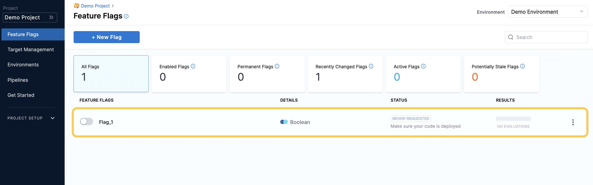

Feature Flags allow you to toggle features in your code on or off, which allows you to progressively roll out features to particular users or groups. By using Feature Flags, you can manage continuous delivery and control who sees which features and when.

This topic describes how to create a Feature Flag in the Harness platform. 

A Feature Flag is available only for the Project the Flag is created in, so you’ll need to create any relevant Flags you want to use in each Project you want to use them for.  
  
You can use the same Flags across multiple Environments within a single project, but the Flag status in each Environment is independent.### Before you begin

Before you create a Feature Flag, you must have:

1. [Created a Project](create-a-project.md)
2. [Created an Environment](create-an-environment.md)
3. [Created an SDK Key](create-an-sdk-key.md)

### How Feature Flag Variations work

When you create a Feature Flag, you also create different options to label the logic of that Flag. These are called Flag Variations, for example, a simple Boolean flag would have only two Variations, `true` and `false`. However, there are two different types of Feature Flags you can create:

* **Boolean**: Has only two Variations; true and false.

*Figure 1: Variations of a boolean Flag*

* **Multivariate**: Has multiple Variations, you can add as many custom Variations as you like.

*Figure 2: Variations of a multivariate Flag*

### Create a boolean Flag

1. In **Feature Flags**, click **+ New Flag**.
2. Select **Boolean**.
3. In **About the Flag**, in **Name**, enter a name for your Flag and click **Next**.

When you name a Flag, Harness automatically generates its identifier. You can edit the Identifier when you are creating the Flag, but not after it is saved. If you rename the Flag, the Identifier remains the same. For more information, go to [Entity Identifier Reference](https://ngdocs.harness.io/article/li0my8tcz3-entity-identifier-reference).1. To make the Feature Flag permanent, select the **This is a permanent flag** checkbox. Permanent Flags are flags you intend to stay in your system indefinitely, so we will never mark them as potentially stale.
2. Click **Next**.
3. In **Variation** **settings**, in **Flag Type**, select **Boolean**.
4. In the **Name** fields, enter the name for the true and false variations, for example, **True** and **False**.
5. In **Default rules for the flag**, select which variation of the flag to serve when the flag is ON or OFF, for example, True when the flag is ON and False when the flag is OFF.

*Figure 3: Variation settings*

1. Click **Save and Close**. The Feature Flag is created and is set to **OFF** by default.

*Figure 4: A boolean Flag*

After you have created your Boolean Flag, you can then:

* [Manage the Variations of the Feature Flag](../update-feature-flags/manage-variations.md)
* [Add Flag Prerequisites](../ff-adding-prereqs/add-prerequisites-to-feature-flag.md)
* [Targeting Users with Flags](../ff-target-management/targeting-users-with-flags.md)

### Create a multivariate Flag

Multivariate Feature Flags allow you to serve a different Variation of a Flag to multiple user groups at one time.  For example, a multivariate Flag could have the following Variations:

* Variation 1 set to OFF
* Variation 2 set to ON
* Variation 3 set to be served only when a user has a certain email address

There is no limit to the amount of Variations that you can add to a multivariate Flag, and you can use strings, numbers, or JSON to define the different Variants. 

To create a multivariate Flag:

1. In **Feature Flags**, click **+ New Flag**.
2. Select **Multivariate**.
3. In **About the Flag**, in **Name**, enter a name for your Flag and click **Next**.
4. To make the Feature Flag permanent, select the **This is a permanent flag** checkbox. Permanent Flags are flags you intend to stay in your system indefinitely, so we will never mark them as potentially stale. For example, if you are offering a premium feature to some of your customers but not others, you can use a permanent flag to manage who sees this feature indefinitely.
5. In **Variation settings**, in **Flag Type**, select **Multivariate** and then select the **Data Type**. You can select, **String**, **JSON**, or **Number**.
6. Enter a **Name** and **Value** for each Variation you want to use.
7. In **Default rules for the flag**, define which Variation you will see by default when the Flag is ON or OFF.

*Figure 5: Variation settings of a multivariate fFag*

After you have created your multivariate Flag, you can then:

* [Manage the Variations of the Feature Flag](../update-feature-flags/manage-variations.md)
* [Add Flag Prerequisites](../ff-adding-prereqs/add-prerequisites-to-feature-flag.md)
* [Target Users with Flags](../ff-target-management/targeting-users-with-flags.md)

