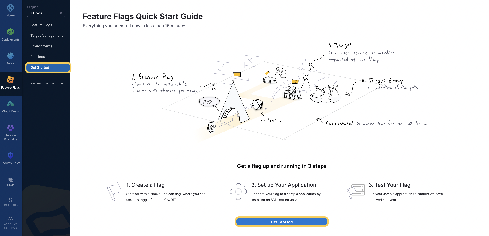

This guide describes the basic steps for getting started with Harness Feature Flags.

### Visual summary

For an overview of Harness Feature Flags, watch the following video:

Watch Feature Flag overview video### Basic steps for creating a Feature Flag

To create a Flag, you need to complete the following steps:

1. [Create a Project](../ff-creating-flag/create-a-project.md) to host your Flags in.
2. [Create an Environment](../ff-creating-flag/create-an-environment.md) within your Project. You can have multiple Environments in a single Project.
3. [Create an SDK Key](../ff-creating-flag/create-an-sdk-key.md) for your Environment. You use this to connect to a Feature Flag SDK.
4. [Create a Feature Flag](../ff-creating-flag/create-a-feature-flag.md).
5. [Connect your application using one of our SDKs]**TODO:** Update category link **TODO:** Update category link **TODO:** Update category link (/category/rtce97j1wu-ff-sdks).

You can also follow the Get Started tutorial for Feature Flags on the Harness Platform.

*Figure 1:* **Th***e Get Started tutorial for Feature Flags*

*Figure 1:* **Th***e Get Started tutorial for Feature Flags*

### Next steps

Once you have created your Flag, you can then:

* [Manage Targets]**TODO:** Update category link **TODO:** Update category link **TODO:** Update category link (https://ngdocs.harness.io/category/xw2hz815l8-target-management)
* Modify [Variations](../update-feature-flags/manage-variations.md) and [Rules](../ff-target-management/targeting-users-with-flags.md)
* [Add Prerequisites](../ff-adding-prereqs/add-prerequisites-to-feature-flag.md)

