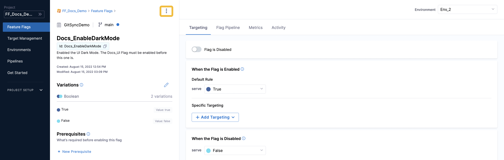
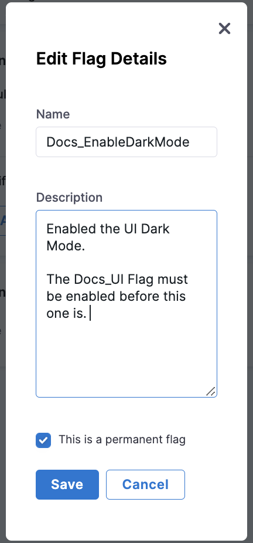

After you have created a Flag, you can edit the following details of it:

* Flag Name
* Description
* Whether or not it is marked as permanent

This topic describes how to edit these details on the Harness Platform.

### Edit the Details of a Flag

To edit a Flag:

1. In Harness, go to **Feature Flags**.
2. In your Project, click **Feature Flags**. All your current Flags are listed.
3. Next to the Flag you want to edit, click **more** **options (****︙****).**
4. Click **Edit**. The Flag details page appears, then click **more** **options (****︙****).**

*Figure 1: More options for editing a Flag*

1. Edit the relevant details.

*Figure 2: Details you can edit for a Flag*

1. Click **Save**.

### See also

You can also:

* [Edit your Flag Variations](manage-variations.md)
* [Add Prerequisite Flags](../ff-adding-prereqs/add-prerequisites-to-feature-flag.md)
* [Manage Your Targets]**TODO:** Update category link **TODO:** Update category link **TODO:** Update category link (/category/xw2hz815l8-ff-target-management)

