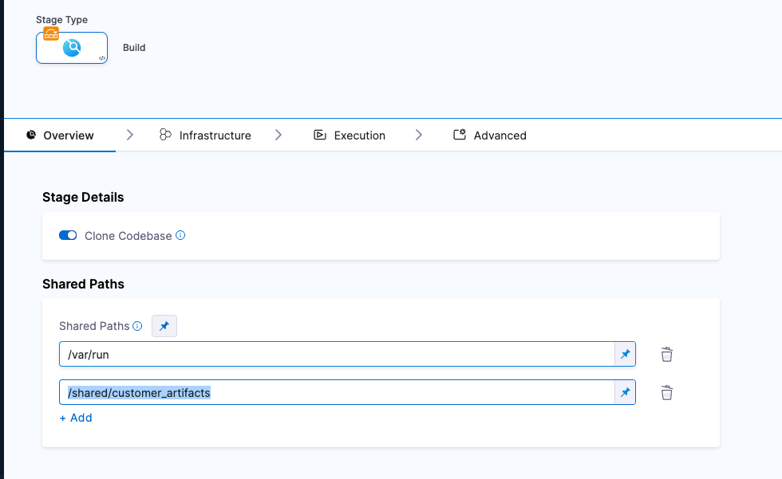

You can run scans in a separate Run step, or outside Harness entirely, and ingest the results into your pipelines. This enables you to create advanced workflows that aren't possible with orchestrated scans. You can run custom scans with advanced settings that address specific security requirements. You can ingest results from multiple scans into the same pipeline, aggregate and deduplicate the data, and view all your results in a single pane of glass.

STO also supports a generic JSON format if you want to to ingest data from tools that do not currently have STO integrations. For more information, go to [Custom Scanners Reference](ingesting-issues-from-other-scanners.md).

 To ingest scan results from outside a Security step, you set up your pipeline as follows:

* A Run step saves scan results to a shared folder. The step might run the scan locally or download results from an external source.
* A Security step ingests the results from the shared folder. Then it analyzes, deduplicates, and displays the results.

### Example Workflow

The following example describes how to scans a local image using [Aqua Trivy](https://aquasecurity.github.io/trivy/dev/docs/), a popular open-source scanner, and ingest the results. A Run step installs Trivy; then it scans the image and saves the output to a shared folder. A Security step then ingests the output file.

1. In your Harness pipeline, go to the Overview tab of the security stage and enter a shared path such as `/shared/customer_artifacts`.
2. Add a Run step that save the results to the shared folder.  
You can run a scan in this step or copy results from an external scan. In either case, the results file needs to be in the `/shared/customer_artifacts/` folder where the Security step can access it.  
In this example, the Run step installs the Trivy software, runs a scan, and saves the output to `/shared/customer_artifacts/aqua.json`.  
For [supported scanners](../sto-techref-category/security-step-settings-reference.md#scanners-target-types-and-scan-approach), STO can ingest the default data format for the published tool.  

```
apt-get update -y  
apt-get install wget apt-transport-https gnupg lsb-release -y  
wget -qO - https://aquasecurity.github.io/trivy-repo/deb/public.key | apt-key add -  
echo deb https://aquasecurity.github.io/trivy-repo/deb $(lsb_release -sc) main | tee -a /etc/apt/sources.list.d/trivy.list  
apt-get update -y  
apt-get install trivy -y  
trivy -v  
trivy -q image --timeout 20m -f json -o /shared/customer_artifacts/aqua.json redhat/ubi8-minimal:latest
```
3. Add a Security step and configure the scanner to ingest the results of the scan.  
These settings are required:
	1. `policy_type` = `ingestionOnly`
	2. `scan_type` = The object type to scan: `container`, `repository`, `instance`, or `configuration`
	3. `product_name` = The `product_name` strings such `aqua-trivy`, `bandit`, `snyk`, `sonarqube`, etc.
	4. `product_config_name`: One of the `product_config_name` strings for the supported scanner.
	5. `manual_upload_filename`: The filename of the issues data file generated by the scanner.
	6. `customer_artifacts_path`: The shared folder for the issues data file.To ingest the Trivy scan results, we configure the step as follows:
	1. `policy_type` = `ingestionOnly`
	2. `scan_type` = `container`
	3. `product_name` = `aqua-trivy`
	4. `product_config_name` = `default`
	5. `customer_artifacts_path` = `/shared/customer_artifacts`
	6. `manual_upload_filename` = `aqua.json`
4. Specify any additional settings required for your specific scanner and the scanned object. Go to [Security Step Settings Reference](../sto-techref-category/security-step-settings-reference.md).  
For the Trivy scan, we need to specify additional information about the scanned object:
	1. `container_type` = `docker_v2`
	2. `container_project` = `<`*`project`*`>/<`*`image`*`>: <`*`tag`*`>`  
	For example: `docker pull redhat/ubi8-minimal:latest`
	3. `container_tag` = `latest`

### YAML Pipeline Example

The following example is based on the example workflow described in this topic.

trivy-ingestion-only-pipeline-example.yml
```
  pipeline:  
  projectIdentifier: my-project-id  
  orgIdentifier: my-org-id  
  identifier: aquatrivyingestionOnly  
  name: aqua-trivy-ingestionOnly  
  tags: {}  
  properties:  
    ci:  
      codebase:  
        connectorRef: $GIT_REPO_CONNECTOR  
        build: <+input>  
  stages:  
    - stage:  
        name: build  
        identifier: build  
        type: CI  
        spec:  
          cloneCodebase: true  
          infrastructure:  
            type: KubernetesDirect  
            spec:  
              connectorRef: $K8S_DELEGATE_CONNECTOR  
              namespace: $K8S_DELEGATE_NAMESPACE  
              automountServiceAccountToken: true  
              nodeSelector: {}  
              os: Linux  
          sharedPaths:  
            - /var/run  
            - /shared/customer_artifacts  
          serviceDependencies:  
            - identifier: dind  
              name: dind  
              type: Service  
              spec:  
                connectorRef: $DOCKER_HUB_CONNECTOR  
                image: docker:dind  
                privileged: true  
                entrypoint:  
                  - dockerd-entrypoint.sh  
          execution:  
            steps:  
              - step:  
                  type: Run  
                  name: runTrivyScan  
                  identifier: runTrivy  
                  spec:  
                    connectorRef: $DOCKER_HUB_CONNECTOR  
                    image: ubuntu:20.04  
                    shell: Sh  
                    command: |-  
                      apt-get update -y  
                      apt-get install wget apt-transport-https gnupg lsb-release -y  
                      wget -qO - https://aquasecurity.github.io/trivy-repo/deb/public.key | apt-key add -  
                      echo deb https://aquasecurity.github.io/trivy-repo/deb $(lsb_release -sc) main | tee -a /etc/apt/sources.list.d/trivy.list  
                      apt-get update -y  
                      apt-get install trivy -y  
                      trivy -v  
                      trivy -q image --timeout 20m -f json -o /shared/customer_artifacts/aqua.json redhat/ubi8-minimal:latest  
              - step:  
                  type: Security  
                  spec:  
                    privileged: true  
                    settings:  
                      scan_type: container  
                      product_name: aqua-trivy  
                      product_config_name: default  
                      policy_type: ingestionOnly  
                      container_type: docker_v2  
                      container_tag: latest  
                      container_project: redhat/ubi8-minimal  
                      customer_artifacts_path: /shared/customer_artifacts  
                      manual_upload_filename: aqua.json  
                    imagePullPolicy: Always  
                    resources:  
                      limits:  
                        memory: 1024Mi  
                        cpu: 1000m  
                  name: ingestTrivyData  
                  identifier: aqua_trivy  
  
  
```
### See Also

* [STO Ingestion Workflows](sto-workflows-overview.md)
* [Ingest Results from Custom or Unsupported Scanners](ingesting-issues-from-other-scanners.md)
* [Security Step Settings Reference](../sto-techref-category/security-step-settings-reference.md)

