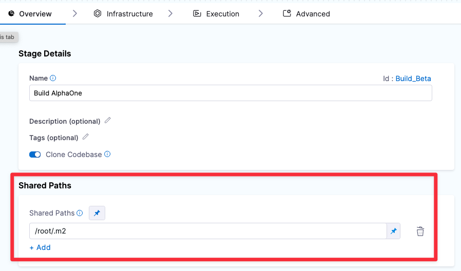

This topic describes how to share CI data across Steps and Stages.

### Share Data Across Steps

Each Stage has a common `/harness` folder. Any Step in the Stage can
create, retrieve, update, and delete files in this folder.

You can declare Shared Paths for a Stage. Any Step in the Stage can
create, retrieve, update, and delete data in a Shared Path. Suppose you
use Maven to manage your software projects. Each Step uses `/root/.m2`
as the Maven repository, which is outside the common `/harness` folder.
This means you need to declare it as a Shared Path in the Pipeline
Editor.

To declare a Shared Path, open the Stage, go to the Overview tab, click
**Shared Paths**, and add the subfolder such as `/root/.m2`. Once you do
this, any Step can then access `/root/.m2`.

{style="max-height:50%;max-width:50%;display:block;margin-left:0;margin-right:auto"
hd-height="50%" hd-width="50%" hd-align="left"}

### Share Data Across Stages

You can share data across Stages using AWS or GCS buckets:

1.  Save your cache using [Save Cache to
    S3](https://ngdocs.harness.io/article/qtvjvrp9sn) or [Save Cache to
    GCS](https://ngdocs.harness.io/article/11nzeuntrz).
2.  Retrieve your cache using [Restore Cache from
    S3](https://ngdocs.harness.io/article/zlpx6lli6d) or [Restore Cache
    from
    GCS](https://ngdocs.harness.io/article/e2o4sektz1){target="_blank"}.

::: note-callout
You cannot share access credentials or other [Text
Secrets](https://ngdocs.harness.io/article/osfw70e59c-add-use-text-secrets)
across Stages.
:::

For complete end-to-end examples, see the following how-tos:

-   [Save and Restore Cache from
    S3](https://ngdocs.harness.io/article/qibyllcmza){target="_blank"}
-   [Save and Restore Cache from
    GCS](https://ngdocs.harness.io/article/v0agy0hlyj){target="_blank"}
