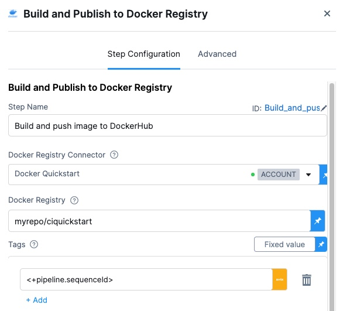
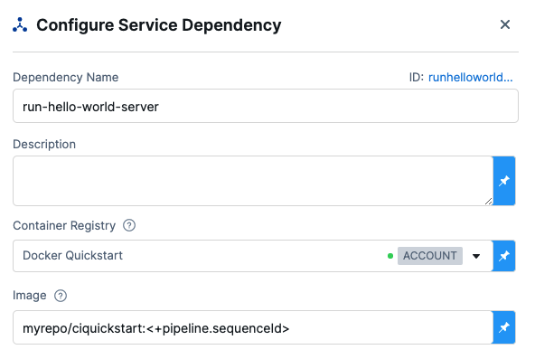
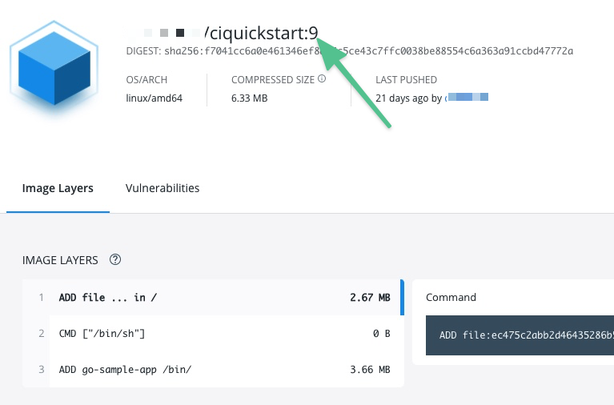
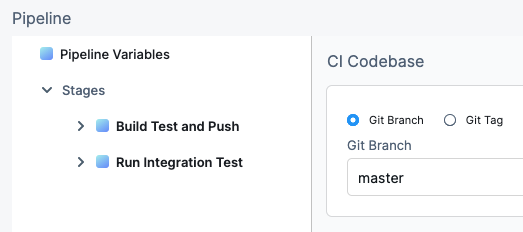
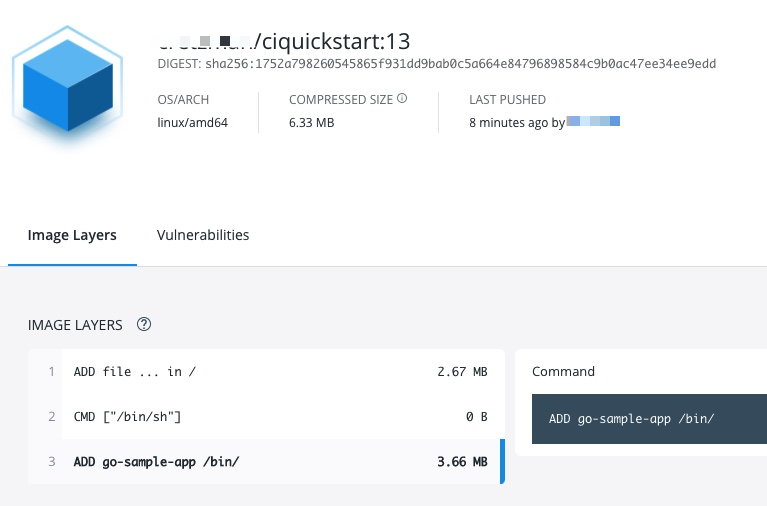

Once you\'ve defined a build farm in the CI stage\'s Infrastructure, you
can add a Build and Push step to build your codebase and push the
artifact to a repo. The following repos are supported:

-   Docker
-   Azure Container Registry (ACR)
-   Google Container Registry (GCR)
-   Amazon Elastic Container Registry (ECR)

For setting up a build farm, see: [Set Up Build
Infrastructure](/category/rg8mrhqm95-set-up-build-infrastructure).

This topic describes a simple one-step build workflow, minus testing:
build the code in a build farm and then push it to a repo. For a quick
summary of a build, push, and test Pipeline, see [CI Pipeline
Quickstart](/article/x0d77ktjw8-ci-pipeline-quickstart).

For details about each build and push step, see [CI Technical
Reference](/category/4xo13zdnfx-ci-technical-reference).

In this topic:

-   [Before You
    Begin](https://ngdocs.harness.io/article/8l31vtr4hi-build-and-upload-an-artifact#before_you_begin)
-   [Visual
    Summary](https://ngdocs.harness.io/article/8l31vtr4hi-build-and-upload-an-artifact#visual_summary)
-   [Step 1: Create the CI
    Stage](https://ngdocs.harness.io/article/8l31vtr4hi-build-and-upload-an-artifact#step_1_create_the_ci_stage)
-   [Step 2: Add the
    Codebase](https://ngdocs.harness.io/article/8l31vtr4hi-build-and-upload-an-artifact#step_2_add_the_codebase)
-   [Step 3: Define the Build Farm
    Infrastructure](https://ngdocs.harness.io/article/8l31vtr4hi-build-and-upload-an-artifact#step_3_define_the_build_farm_infrastructure)
-   [Step 4: Add the Build and Push
    Step](https://ngdocs.harness.io/article/8l31vtr4hi-build-and-upload-an-artifact#step_4_add_the_build_and_push_step)
    -   [Option: Add a Tag using Harness
        Expression](https://ngdocs.harness.io/article/8l31vtr4hi-build-and-upload-an-artifact#option_add_a_tag_using_harness_expression)
    -   [Option: Build a Docker Image without
        Pushing](https://ngdocs.harness.io/article/8l31vtr4hi-build-and-upload-an-artifact#option_build_a_docker_image_without_pushing)
-   [Step 5: Specify Codebase Branch or Tag at Pipeline
    Execution](https://ngdocs.harness.io/article/8l31vtr4hi-build-and-upload-an-artifact#step_5_specify_codebase_branch_or_tag_at_pipeline_execution)
-   [Step 6: View the
    Results](https://ngdocs.harness.io/article/8l31vtr4hi-build-and-upload-an-artifact#step_6_view_the_results)
-   [Configure As
    Code](https://ngdocs.harness.io/article/8l31vtr4hi-build-and-upload-an-artifact#configure_as_code)
-   [See
    Also](https://ngdocs.harness.io/article/8l31vtr4hi-build-and-upload-an-artifact#see_also)

### Before You Begin

You should be familiar with the following:

-   [CI Pipeline Quickstart](/article/x0d77ktjw8-ci-pipeline-quickstart)
-   [CI Stage Settings](/article/yn4x8vzw3q-ci-stage-settings)
-   [Set Up Build
    Infrastructure](/category/rg8mrhqm95-set-up-build-infrastructure)
-   [Learn Harness\' Key
    Concepts](/article/hv2758ro4e-learn-harness-key-concepts)

### Visual Summary

Here\'s a short video showing how to set up a Build and Push step.

::: {.hd--embed provider="YouTube" thumbnail="https://i.ytimg.com/vi/v3A4kF1Upqo/hqdefault.jpg"}
::: iframe
::: {#player}
:::

::: player-unavailable
# An error occurred. {#an-error-occurred. .message}

::: submessage
[Try watching this video on
www.youtube.com](https://www.youtube.com/watch?v=v3A4kF1Upqo){target="_blank"},
or enable JavaScript if it is disabled in your browser.
:::
:::
:::
:::

### Step 1: Create the CI Stage

In your Harness Pipeline, click **Add Stage**, and then click **CI**.

### Step 2: Add the Codebase

Do one of the following:

-   If this is the first CI stage in the Pipeline, in the CI stage
    settings, enable **Clone Codebase**.
-   If you have an existing Pipeline with a CI stage, click **Codebase**
    on the right.

In **Connector**, select an existing Connector to your codebase repo, or
create a new one. See [Code Repo
Connectors](/category/xyexvcc206-ref-source-repo-provider).

You can see the URL for the repo account below **Repository Name**.
Don\'t add the URL into **Repository Name**.

In **Repository Name**, enter the name of the repo containing the
codebase.

For example, if the account URL is **https://github.com/mycompany** and
the repo in that account is **myapp**, you can simply enter **myapp** in
**Repository Name**.

You specify the codebase repo here, but you enter the Git branch or tag
when you deploy the Pipeline.

### Step 3: Define the Build Farm Infrastructure

In the CI stage **Infrastructure**, define the build farm for the
codebase.

The following example uses a Kubernetes cluster build farm.

In **Select a Kubernetes Cluster**, select or create a Kubernetes
Connector. This Connector connects Harness to the cluster to use as the
build farm. See [Kubernetes Cluster Connector Settings
Reference](/article/sjjik49xww-kubernetes-cluster-connector-settings-reference).

In **Namespace**, enter the Kubernetes namespace to use. You can use a
text string, a Runtime Input (`<+input>`), or an expression. See
[Runtime Inputs](/article/f6yobn7iq0-runtime-inputs).

See [Define Kubernetes Cluster Build
Infrastructure](/article/x7aedul8qs-kubernetes-cluster-build-infrastructure-setup).

### Step 4: Add the Build and Push Step

In the stage\'s **Execution**, add a Build and Push step. See the
following topics, based on the registry provider:

-   Docker: [Build and Push to Docker Registry
    Step](/article/q6fr5bj63w-build-and-push-to-docker-hub-step-settings)
-   Azure Container Registry (ACR): Use [Build and Push to Docker
    Registry
    Step](/article/q6fr5bj63w-build-and-push-to-docker-hub-step-settings)
-   Google Container Registry (GCR): [Build and Push to GCR
    Step](/article/66ykcm0sf0-build-and-push-to-gcr-step-settings)
-   Amazon Elastic Container Registry (ECR): [Build and Push to ECR Step
    Settings](/article/aiqbxaef15-build-and-push-to-ecr-step-settings)

For all Build and Push steps, you select or create a Connector for the
target repo, add repo-specific information, and specify Dockerfile
information.

#### Option: Add a Tag using Harness Expression

When you push the image to a repo, you tag the image so you can identify
it later.

For example, in one stage you push the image, and in a future stage you
pull it using its name and tag so you can run integration tests on it.

You can tag the image in any way, but a Harness expression can be very
useful.

Let\'s look at an example:

The `<+pipeline.sequenceId>` tags this image in future stages. For
example, `harnessdev/ciquickstart:<+pipeline.sequenceId>`.

In the [Configure Service
Dependency](/article/vo4sjbd09g-configure-service-dependency-step-settings)
Step in a later Stage in the Pipeline, you identify the image location
using `<+pipeline.sequenceId>`.

The `<+pipeline.sequenceId>` is a built-in Harness variable that
represents the **Build ID** number, for example `Build ID: 9`.

After the Pipeline runs you\'ll see a Build ID:

And this Build ID tags the image you push in one stage of your Pipeline,
and pull in the image in future stages of your Pipeline.

You\'ll also see the ID as the tag on the image in your repo:

#### Option: Build a Docker Image without Pushing

Suppose you want to test the Dockerfile used in your Codebase and verify
that the resulting image is correct, before you push it to your Docker
repository. To enable this in your Pipeline, do the following.

1.  In your CI Pipeline, go to the Build Stage that includes the Build
    and Push an Image to Docker Repository step that you want to
    customize.
2.  In the Build Stage Overview, expand the Advanced pane.
3.  Click Add Variable and enter the following:
    1.  NAME = **PLUGIN_NO_PUSH**
    2.  TYPE = **String**
    3.  VALUE = **true**
4.  Save and run the Pipeline. 

### Step 5: Specify Codebase Branch or Tag at Pipeline Execution

Once you click **Run Pipeline**, provide the Git branch or tag to use
for the execution.

Enter the branch or tag and click **Run Pipeline**.

### Step 6: View the Results

You can see the logs for the Build and Push Step in the Pipeline as it
runs.

Here\'s an example that pushes to a Docker repository:

    /kaniko/executor --dockerfile=Dockerfile --context=dir://. --destination=cretzman/ciquickstart:13

    Retrieving image manifest alpine:3.12        
    Retrieving image alpine:3.12                 
    Retrieving image manifest alpine:3.12        
    Retrieving image alpine:3.12                 
    Built cross stage deps: map[]                
    Retrieving image manifest alpine:3.12        
    Retrieving image alpine:3.12                 
    Retrieving image manifest alpine:3.12        
    Retrieving image alpine:3.12                 
    Executing 0 build triggers                   
    Unpacking rootfs as cmd ADD go-sample-app /bin/ requires it. 
    LABEL maintainer="John Doe <john.doe@example.com>" 
    Applying label maintainer=John Doe <john.doe@example.com> 
    Using files from context: [/step-exec/workspace/go-sample-app] 
    ADD go-sample-app /bin/             
    Taking snapshot of files...                  
    ENTRYPOINT ["/bin/go-sample-app"]

On Docker Hub, you can see the image that you pushed.

In your Harness project\'s **Builds**, you can see the build listed.

### Configure As Code

Here\'s an example of the stage with a Build and Push step set up:

    pipeline:
      name: CI Quickstart
      identifier: CI_Quickstart
      properties:
        ci:
          codebase:
            connectorRef: account.CI_Quickstart
            repoName: goHelloWorldServer
            build: <+input>
      stages:
        - stage:
            name: Build Test and Push
            identifier: Build_Test_and_Push
            type: CI
            spec:
              cloneCodebase: true
              execution:
                steps:
                  - step:
                      type: BuildAndPushDockerRegistry
                      name: Build and push image to DockerHub
                      identifier: Build_and_push_image_to_DockerHub
                      spec:
                        connectorRef: account.Docker_Quickstart
                        repo: cretzman/ciquickstart
                        tags:
                          - <+pipeline.sequenceId>
              infrastructure:
                type: KubernetesDirect
                spec:
                  connectorRef: account.cidelegate
                  namespace: harness-delegate-uat
              serviceDependencies: []
      projectIdentifier: CI_Quickstart
      orgIdentifier: default

### See Also

-   [Run Step Settings](/article/1i1ttvftm4-run-step-settings)
