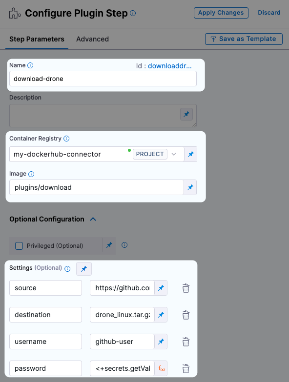
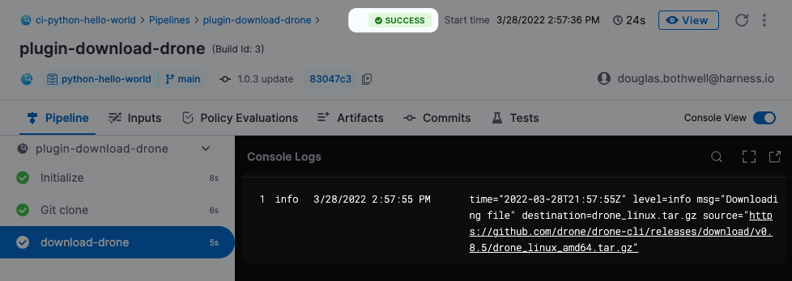
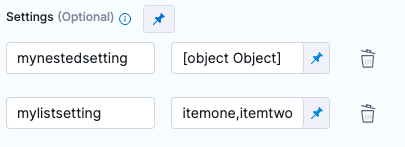

A plugin is a Docker container that performs a predefined task. Plugins
are essentially templated scripts that can be written in any programming
language. The Drone community maintains an [extensive
library](https://plugins.drone.io/){target="_blank"} of plugins for
specific CI workflows. You can customize and extend your build processes
using existing plugins or [write your
own](https://harness.io/blog/continuous-integration/write-first-plugin-for-cie/){target="_blank"}.

This topic describes how to set up and run plugins in your CI Pipelines.

-   [Before You
    Begin](https://ngdocs.harness.io/article/fjagoj8mez-run-a-drone-plugin-in-ci#before_you_begin)
-   [Workflow
    Description](https://ngdocs.harness.io/article/fjagoj8mez-run-a-drone-plugin-in-ci#workflow_description)
-   [Simple Example: Download a
    File](https://ngdocs.harness.io/article/fjagoj8mez-run-a-drone-plugin-in-ci#simple_example_download_a_file)
-   [Drone Plugin YAML and CI Step
    YAML](https://ngdocs.harness.io/article/fjagoj8mez-run-a-drone-plugin-in-ci#drone_plugin_yaml_and_ci_step_yaml)
    -   [Text Secrets in Drone vs. Harness
        CI](https://ngdocs.harness.io/article/fjagoj8mez-run-a-drone-plugin-in-ci#text_secrets_in_drone_vs_harness_ci)
    -   [Define Nested and List
        Settings](https://ngdocs.harness.io/article/fjagoj8mez-run-a-drone-plugin-in-ci#define_nested_and_list_settings)
-   [See
    also](https://ngdocs.harness.io/article/fjagoj8mez-run-a-drone-plugin-in-ci#see_also)

### Before You Begin

To install and run a plugin, you need the following:

-   A familiarity with basic Harness CI concepts:
    -   [CI Pipeline
        Quickstart](https://ngdocs.harness.io/article/x0d77ktjw8-ci-pipeline-quickstart)
    -   [Learn Harness\' Key
        Concepts](https://ngdocs.harness.io/article/hv2758ro4e-learn-harness-key-concepts)
-   A build infrastructure and Delegate to run builds:
    -   [Set Up Build
        Infrastructure](https://ngdocs.harness.io/category/rg8mrhqm95-set-up-build-infrastructure)
    -   [Install a Kubernetes
        Delegate](https://ngdocs.harness.io/article/f9bd10b3nj-install-a-kubernetes-delegate)
        *or* [Install a Docker
        Delegate](https://ngdocs.harness.io/article/cya29w2b99-install-a-docker-delegate)
-   A CI Pipeline with a Build Stage to run the plugin:
    -   [CI Stage
        Settings](https://ngdocs.harness.io/article/yn4x8vzw3q-ci-stage-settings)
-   You should create text secrets for any sensitive information
    required by the plugin, such as a password or Personal Access Token.
    You\'ll need to reference the IDs for any secrets when you set up
    the Plugin Step.
    -   [Add and Use Text
        Secrets](https://ngdocs.harness.io/article/osfw70e59c-add-use-text-secrets#add-and-reference-text-secrets)

### Workflow Description

The following steps describe the high-level workflow:

1.  Go to the Pipeline and open the Build step where you want to run the
    plugin.
2.  In the Execution tab, click **Add step** and select **Plugin**.
3.  Enter the following:
    1.  **Name:** A unique, descriptive name.
    2.  **Container Registry:** A Connector to the image registry (such
        as Docker Hub) of the plugin image.
    3.  **Image:** The full image name, such
        as`dockerhubusername/my-plugin:2.3.1`. The Step uses the latest
        image if you don\'t specify a tag.
    4.  Under Optional Configuration \> Settings, add any other settings
        that are required as specified in the docs for the specific
        plugin.
4.  Click **Apply Changes** to apply your Stage settings, then **Save**
    to save the updated Pipeline
5.  Run the updated Pipeline and check the log output to verify that the
    Plugin Step works as intended.

### Simple Example: Download a File

This example describes how to run the Drone Downloads plugin, which
downloads an archive to your build infrastructure. You can use the
following workflow to implement any plugin.

1.  Go to the [Drone Plugins Hub](https://plugins.drone.io/) and read
    the description for the specific plugin. The description should
    indicate the plugin image and the required settings.\
    The [Download plugin
    doc](https://plugins.drone.io/plugins/download){target="_blank"}
    shows the image to use (`plugins/download`) and the settings that
    the plugin supports: `source`, `destination`, `username`,
    `password`, and so on.
2.  Go to the Build Stage in a CI Pipeline. In the Execute tab, add a
    **Plugin** step.
3.  Configure the Step as follows.

-   **Name:** A unique, descriptive name.
-   **Container Registry:** A Connector to Docker Hub.
-   **Image:** The plugin image \--in this case, `plugins/download`
-   Under Optional Configuration, add the following settings:
    -   `source` = The artifact to download.

    -   `destination` = Save the downloaded artifact to this file.

    -   `username` = A valid username for the Git provider.

    -   `password` = The ID of the text secret that contains the Git
        provider password, using the convention described
        [here](https://ngdocs.harness.io/article/osfw70e59c-add-use-text-secrets#step_3_reference_the_encrypted_text_by_identifier).
        For example:
        `<+secrets.getValue("mygithubpersonalaccesstoken")>`

        {style="max-height:50%;max-width:50%;display:block;margin-left:0;margin-right:auto"
        hd-height="50%" hd-width="50%" hd-align="left"}

1.  Click **Apply Changes** to apply your Stage settings, then **Save**
    to save the updated Pipeline

2.  Run the updated Pipeline and check the log output to verify that the
    Plugin Step works as intended.

    {style="max-height:50%;max-width:50%;display:block;margin-left:0;margin-right:auto"
    hd-height="50%" hd-width="50%" hd-align="left"}

### Drone Plugin YAML and CI Step YAML

You can use the examples in [Drone plugin
descriptions](https://plugins.drone.io/) to configure a Plugin Step in
the Pipeline YAML editor. The formats are slightly different, but close
enough that translating Drone Plugin definitions to Harness CI is fairly
simple. You can see additional examples in [this blog
post](https://harness.io/blog/continuous-integration/github-actions-support-harness-ci/).

#### Text Secrets in Drone vs. Harness CI

The following snippets illustrate the different ways that Drone and
Harness CI handle text secrets. See [Add and Use Text
Secrets](https://ngdocs.harness.io/article/osfw70e59c-add-use-text-secrets).

Note that the CI definition includes a few additional fields and that
some fields use different formats.

+-----------------------------------+-----------------------------------+
| Example from Drone Download       |                                   |
| description:                      |                                   |
|                                   |                                   |
| ``` {.hljs .yaml}                 |                                   |
| steps:                            |                                   |
| - name: download                  |                                   |
|   image: plugins/download         |                                   |
|   settings:                       |                                   |
|     username:                     |                                   |
|      from_secret: username        |                                   |
|     password:                     |                                   |
|       from_secret: password       |                                   |
|     source: https://github.com/   |                                   |
| drone/drone-cli/releases/download |                                   |
| /v0.8.5/drone_linux_amd64.tar.gz  |                                   |
|                                   |                                   |
| ```                               |                                   |
+-----------------------------------+-----------------------------------+
| Equivalent definition in Harness  |                                   |
| CI Pipeline:                      |                                   |
|                                   |                                   |
| ``` {.hljs .yaml}                 |                                   |
|   - step:                         |                                   |
|         type: Plugin              |                                   |
|         name: download-drone      |                                   |
|         identifier: downloaddrone |                                   |
|         spec:                     |                                   |
|                                   |                                   |
|   connectorRef: mygithubconnector |                                   |
|                                   |                                   |
|           image: plugins/download |                                   |
|             privileged: false     |                                   |
|             settings:             |                                   |
|                 username: <+secr  |                                   |
| ets.getValue("myusernamesecret")> |                                   |
|                 password: <+secr  |                                   |
| ets.getValue("mypasswordsecret")> |                                   |
|                                   |                                   |
|        source: https://github.com |                                   |
| /drone/drone-cli/releases/downloa |                                   |
| d/v0.8.5/drone_linux_amd64.tar.gz |                                   |
| ```                               |                                   |
+-----------------------------------+-----------------------------------+

#### Define Nested and List Settings

You can specify nested and list settings in a Pipeline YAML definition,
as shown here. It\'s easier to define complex settings in the YAML
editor than the UI.

``` {.hljs .yaml}
settings:
  mynestedsetting:
    nextlevel: 
      varname: 100
  mylistsetting:
   - itemone 
   - itemtwo
```

The settings appear in the UI like this:

{style="display:block;margin-left:0;margin-right:auto"
hd-align="left"}

### See also

-   [Drone Community Plugins](https://plugins.drone.io/)
-   [Run a GitHub Action in
    CIE](/article/7kb90dkxw0-run-a-git-hub-action-in-cie){target="_blank"}
-   [Plugin Step
    Settings](/article/8r5c3yvb8k-plugin-step-settings-reference){target="_blank"}
-   [Add and Use Text
    Secrets](https://ngdocs.harness.io/article/osfw70e59c-add-use-text-secrets)
