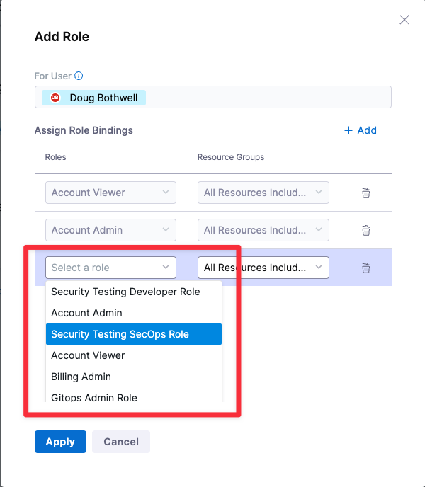
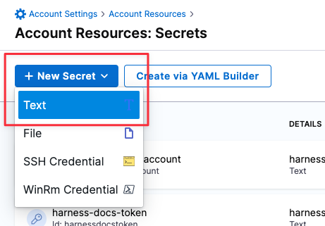
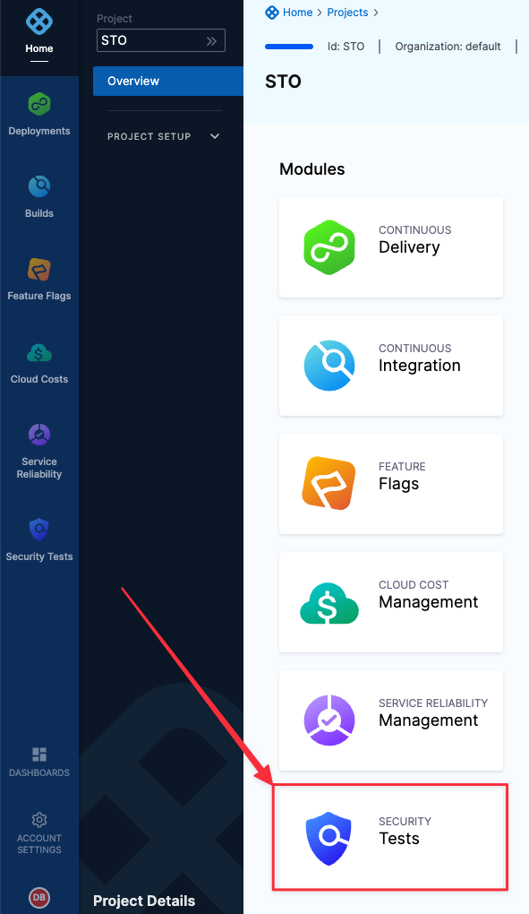
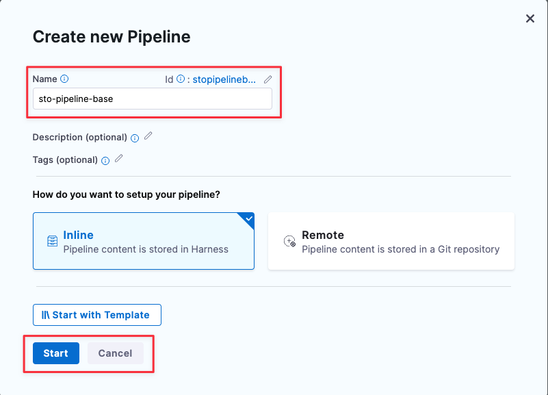
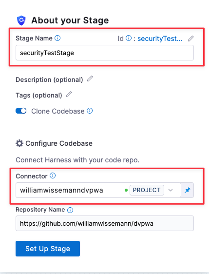
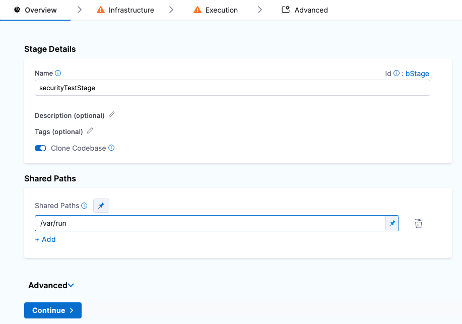
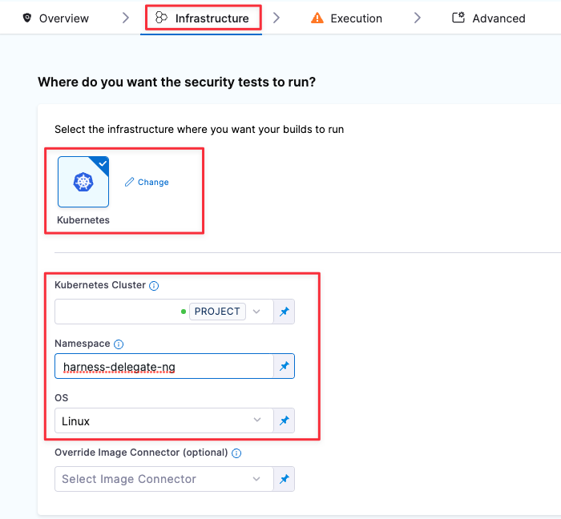
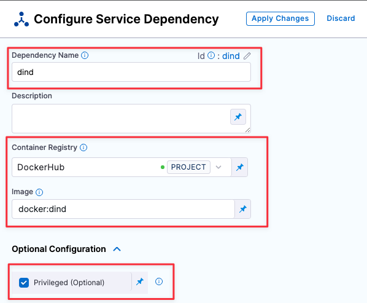
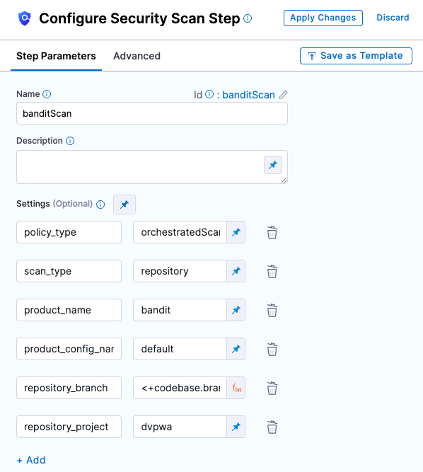

This topic describes the steps you need to do to set up STO in your
pipeline.

The entire setup workflow should take about 30 minutes.

### STO Requirements {#before-you-begin}

You will meet all these requirements after you do the [STO Setup
Procedures](#sto-setup-procedures) described below.

#### External Requirements

Before you start setting up Harness, make sure you have the following:

-   Git account and Personal Access Token --- If you are scanning a
    repo, you need an account and access token with the Git provider.
-   Docker Hub account --- STO uses Docker-in-Docker to run scans. The
    Pipeline needs to pull the **docker:dind** image from Docker Hub. 
-   [Kubernetes
    cluster](#harness-delegate-requirements){target="_blank"} ---
    Running builds in your infrastructure, rather than in a vendor\'s
    cloud, has significant benefits. Vendor clouds often experience
    outages that can result in backlogs and delayed builds. You can
    build software and run tests, repeatedly and automatically, on a
    scalable platform with no outages or backlogs.

#### Harness User Requirements

-   To set up STO, you need Administrative privileges at the Account
    level (Account Admin role). It is not enough to have Administrative
    privileges at the Project level (Project Admin role).
-   Developers need a Security Testing Developer role to run tests and
    view results.
-   Security Operations staff need a Security Testing SecOps role to run
    tests, view results, and approve security exemptions.

#### Harness Account Requirements

Harness recommends you create the following resources at the Account
level. This enables you to use them across all projects and pipelines in
the account.

-   Harness delegate --- Required to run builds in your Kubernetes
    infrastructure.
-   Secret for Git access credentials --- Required to set up a codebase
    connector.
-   Git codebase connector --- Required if you want to scan a codebase
    in your pipeline.
-   Docker Hub connector --- Required to download images needed to run
    the pipeline.

#### Harness Pipeline Requirements

-   To run security scans, the pipeline requires a Security Stage with a
    Docker-in-Docker service dependency.

### STO Setup Procedures

The following sections describe the workflow for setting up STO. Once
you complete this workflow, you will have the build infrastructure and
connectors required to build a pipeline and run security scans. You will
also have an STO-enabled pipeline that you can clone and configure based
on your security requirements.

1.  [Add Security Testing
    roles](https://docs.harness.io/article/rlbw5luj4h#install-the-delegateadd-security-testing-roles)
2.  [Install the Harness
    Delegate](https://docs.harness.io/article/rlbw5luj4h#install-the-delegateinstall-the-harness-delegate){target="_blank"}
3.  [Create a Docker Hub
    connector](#create-a-dockerhub-connector){target="_blank"}
4.  [Create a Secret for your Git Access
    Credentials](https://docs.harness.io/article/rlbw5luj4h#install-the-delegate#create-a-secret){target="_blank"}
5.  [Create a Codebase
    Connector](#https://docs.harness.io/article/rlbw5luj4h#install-the-delegatecreate-a-codebase-connector){target="_blank"}
6.  [Create an STO
    pipeline](https://docs.harness.io/article/rlbw5luj4h#install-the-delegate#create-an-sto-pipeline){target="_blank"}

### Add Security Testing roles

Harness includes two RBAC roles specifically for STO users:

-   **Developer** role --- Permissions needed for developer workflows.
    These workflows are described in [Tutorial
    1](https://docs.harness.io/article/yvy4pmt8bw){target="_blank"}.
-   **SecOps** role --- Permissions needed for Security Operations
    staff. This role includes all Developer permissions and also allows
    users to approve security exemptions. These workflows are covered in
    [Tutorial 2](https://docs.harness.io/article/zy4h4ch6dh).

::: note-callout
You need Administrative privileges at the Account level (Account Admin
role) to assign these roles.
:::

Assign Security Testing Roles: Default Workflow

1.  Click **Account Settings** (left menu) \> **Access Control**.
2.  In the **Users** table, click the user profile.
3.  Under Role Bindings, click **+Role**.
4.  Assign the **Security Testing Developer** role or the **Security
    Testing SecOps** role to the user profile.

{style="display:block;margin-left:0;margin-right:auto"
hd-align="left"}

### Install the Harness Delegate

You need a Kubernetes cluster for Harness to use for the Harness
Delegate and as the Security Testing Orchestration scanning
infrastructure.

Harness Delegate Requirements

-   Number of pods: 3 (two pods for the Harness Delegate, the remaining
    pod for scanning infrastructure).
-   Machine type: 4vCPU.
-   Memory: 16GB RAM. The scanning infrastructure and Delegate
    requirements are low but the remaining memory is for Kubernetes, the
    Docker container, and other default services.
-   Networking: outbound HTTPS for the Harness connection, and to
    connect to Docker Hub. Allow TCP port 22 for SSH.
-   Namespace: when you install the Harness Delegate, it will create the
    **harness-delegate-ng** namespace. You\'ll use the same namespace
    for the scanning infrastructure.
-   A Kubernetes service account with permission to create entities in
    the target namespace is required. The set of permissions should
    include **list**, **get**, **create**, and **delete permissions**.
    In general, the **cluster-admin** role or a namespace *admin*
    permission is enough. For more information, go to [User-Facing
    Roles](https://kubernetes.io/docs/reference/access-authn-authz/rbac/#user-facing-roles){target="_blank"}
    from Kubernetes.

::: note-callout
Google Kubernetes Engine (GKE)
[Autopilot](https://cloud.google.com/kubernetes-engine/docs/concepts/autopilot-overview)
is not supported at this time.
:::

To set up the build infrastructure, you add a connector to your
Kubernetes cluster and install a Harness delegate.

Install the Delegate: Default Workflow

1.  Click **Account Settings** \> **Account Resources** \>
    **Connector**, then **New Connector**.
2.  Under Cloud Providers, choose **Kubernetes cluster**.
3.  Enter the following settings in the wizard.
    1.  In Overview, Name = **STO delegate**

    2.  In Details, click **Use the credentials of a specific Harness
        Delegate**.\
        If you already have a Delegate set up in your Harness account,
        you can use the **Specify master URL and credentials** option.\
        This workflow assumes you are new to Harness.

    3.  Delegate setup: Click **Install new Delegate**.

    4.  Delegate type: click **Kubernetes**.

    5.  Kubernetes setup:\
        You might need to scroll up/down to set all options.
        -   **Delegate Name:** sto.
        -   **Delegate Size:** Small.
        -   **What installer do you want to use?** Kubernetes
        -   **Delegate permissions:** Install Delegate with cluster-wide
            read/write access
        -   **Delegate Configurations:** Primary Configuration
        -   **Delegate Tokens:** default_token

    6.  Download the YAML file.

    7.  In a terminal, navigate to the location of the file.

    8.  In the same Terminal, log into your cluster and run the
        following:\
        `kubectl apply -f harness-delegate.yml`\
        Once you apply the YAML file, you\'ll see an output like this:

            % kubectl apply -f harness-delegate.yml
            namespace/harness-delegate-ng created
            clusterrolebinding.rbac.authorization.k8s.io/harness-delegate-ng-cluster-admin created
            secret/sto-proxy created
            statefulset.apps/sto created
            service/delegate-service created

        In the Harness Delegate setup, you will see the Delegate
        register with Harness. This might take a few minutes.

        ::: note-callout
        If you encounter errors, ensure your cluster can connect
        outbound to **app.harness.io**. See [Allowlist Harness Domains
        and IPs](https://docs.harness.io/article/ooelo06uy5-whitelist-harness-domains-and-ips).
        :::
4.  Click **Done** to close the delegate wizard and return to the
    connector setup.
5.  In **Delegates Setup**, select **Only use Delegates with all of the
    following tags**, select the new delegate, and then click **Save and
    Continue**.
6.  In **Connection Test**, wait for \"Verification successful\" and
    then click **Finish**.

### Create secrets for your Git and DockerHub access credentials {#create-a-dockerhub-connector}

Harness includes a built-in Secrets Manager that enables you to store
encrypted secrets, such as access keys, and use them in your Harness
account. Secrets are always stored in encrypted form and are not
accessible by Harness. Only the delegate, which runs in your
infrastructure, can access them.

In this step, you\'ll create a secret for your GitHub and DockerHub
access tokens. Then you\'ll use the secret when you set up the connector
to your GitHub repo.

Create a Secret for your GitHub Access Token: Default Workflow

1.  In your Github account, a [GitHub Personal Access
    Token](https://docs.github.com/en/authentication/keeping-your-account-and-data-secure/creating-a-personal-access-token){target="_blank"}
    that has the following scopes:
    -   repo
    -   admin:repo_hook
    -   user

2.  Go to **Account Settings** \> **Account Resources** and click
    **Secrets**.

3.  Click **New Secret** \> **Text**.

    {style="display:block;margin-left:0;margin-right:auto"
    hd-align="left"}

4.  Specify the **Secret Name** and **Secret Value** (your GitHub access
    token). It\'s good practice to indicate the scope of the secret in
    the name, as shown in this example.

    {style="display:block;margin-left:0;margin-right:auto"
    hd-align="left"}

5.  Repeat this procedure to create a secret for your [DockerHub access
    token](https://docs.docker.com/docker-hub/access-tokens/){target="_blank"}.

### Create a Docker Hub connector {#create-a-codebase-connector}

A Docker Hub connector is required to run a Docker-in-Docker service as
described in [Set up the Security Tests
stage](#set-up-security-tests-stage){target="_blank"} below. It is also
required for any pipeline that scans or uploads a built image.

Create a Docker Hub Connector: Default Workflow

1.  If you want to upload images to your Docker Hub repo, you will need
    an access token. To do this:
    1.  Create a token: log in to your Docker Hub account and go to
        [https://hub.docker.com/settings/security](https://hub.docker.com/settings/security){target="_blank"}.
    2.  [Create a secret](#create-a-secret){target="_blank"} for your
        token.
2.  Go to the **Account Settings** \> **Account Resources** page and
    select **Connectors**.
3.  Click **New Connector**. Under Artifact Repositories, click **Docker
    Registry**.
4.  In the connector setup wizard, specify the following:
    1.  Docker Registry URL = **https://index.docker.io/v2/**
    2.  Provider Type = **DockerHub**
    3.  Username = Your Docker Hub username
    4.  Password = The secret you created for your Docker Hub access
        token.
5.  In Delegates Setup, select **Use any available Delegate** and then
    click **Save and Continue**.
6.  Wait for \"Verification successful\" and then click **Finish**.

### Create a Codebase Connector

You\'ll need a GitHub Connector to do the [STO
Tutorials](https://docs.harness.io/article/yvy4pmt8bw){target="_blank"}.
You also need a Git repo connector for any STO pipeline that scans a
codebase. You can create connectors for codebases in [AWS
CodeCommit](https://harness.helpdocs.io/article/jed9he2i45){target="_blank"},
[Azure](https://docs.harness.io/article/9epdx5m9ae){target="_blank"},
[Bitbucket](https://harness.helpdocs.io/article/iz5tucdwyu){target="_blank"},
[Git](https://harness.helpdocs.io/article/tbm2hw6pr6){target="_blank"}
(platform-agnostic),
[GitHub](https://harness.helpdocs.io/article/v9sigwjlgo){target="_blank"},
and
[GitLab](https://harness.helpdocs.io/article/5abnoghjgo){target="_blank"}.

::: note-callout
To do the STO tutorials, point the connector at the following repo:
<https://github.com/williamwissemann/dvpwa>
:::

Create a GitHub Connector: Default Workflow

1.  Go to the **Account Settings** \> **Account Resources** page and
    click **Connectors**.
2.  Under Code Repositories, choose **GitHub**.
3.  Specify the following in the setup wizard:
    1.  Overview:\
        Name = **GitHub STO tutorial**.
    2.  Details:\
        **URL Type:** Repository\
        **Connection Type:** HTTP\
        **GitHub Repository URL:**
        https://github.com/williamwissemann/dvpwa
    3.  Credentials:\
        **Username:** Your GitHub username.\
        **Personal Access Token:** Your [GitHub Personal Access Token
        secret](https://docs.harness.io/article/rlbw5luj4h#install-the-delegate#create-a-secret).\
        **Enable API Access:** Select this checkbox and select the same
        secret.
    4.  Connect to the provider:\
        Click **Connect through Harness Platform**.
4.  When you\'re done, click **Save and Continue**. Harness will test
    the connection and credentials. Click **Finish**.

### Create a base pipeline for STO {#create-an-sto-pipeline}

The following procedure creates a pipeline with the STO functionality
required to run scans on your repos, images, and instances. Once you set
up this pipeline, you can clone it to a new pipeline and update the
pipeline to set up your scans. This workflow is described in [STO
Tutorial
1](https://docs.harness.io/article/yvy4pmt8bw){target="_blank"}.

#### Add a Security Test stage

1.  In the Pipeline Studio, click **Home** \> **Projects** and choose
    the project where you want to create the pipeline.

    {style="display:block;margin-left:0;margin-right:auto"
    hd-align="left"}

2.  Under Modules, choose **Security Tests**.\

    {style="max-height:50%;max-width:50%"
    hd-height="50%" hd-width="50%"}

3.  In Create New Pipeline:
    1.  Click **Pipelines** \> **New Pipeline**.

    2.  In Create new Pipeline \> Name, enter **sto-pipeline-base**.

    3.  Click **Start**.

        

4.  In About your Stage:
    1.  Click **Add Stage** and then select **Security Tests**.

    2.  Stage Name = **securityTestStage**

    3.  Connector = The connector you created in [Create a Codebase
        Connector](https://docs.harness.io/article/rlbw5luj4h#install-the-delegate#create-a-codebase-connector){target="_blank"}.

    4.  Click **Set Up Stage**.

        {style="display:block;margin-left:0;margin-right:auto"
        hd-align="left"}

#### Set up the Security Tests stage {#set-up-security-tests-stage}

1.  In the **Overview** tab, under **Shared Paths**, click **Add** and
    enter the path `/var/run`.\

    {style="display:block;margin-left:0;margin-right:auto"
    hd-align="left"}

2.  In the **Infrastructure** tab, specify the following:
    1.  The infrastructure where you want your builds to run
        = **Kubernetes**

    2.  Kubernetes Cluster = The delegate you created in [Install the
        delegate](https://docs.harness.io/article/rlbw5luj4h#install-the-delegate){target="_blank"}.

    3.  Namespace = `harness-delegate-ng`

    4.  OS = `Linux`\

        {style="display:block;margin-left:0;margin-right:auto"
        hd-align="left"}

3.  In the Execution tab, do the following:
    1.  Click **Add Service Dependency**.

    2.  Dependency Name = `dind`

    3.  Container Registry = The image connector you specified
        in [Create a Docker Hub
        connector](https://docs.harness.io/article/create-a-dockerhub-connector).

    4.  Image = `docker:dind`

    5.  Under Optional Configuration, select
        the **Privileged** checkbox.

        {style="display:block;margin-left:0;margin-right:auto"
        hd-align="left"}

#### Add a Security Step

1.  In the Execution tab, click **Add Step** and select **Security**.

2.  Configure the step as follows:
    1.  Name = **banditScan**
    2.  `policy_type` = **`orchestratedScan`**
    3.  `scan_type` = **`repository`**
    4.  `product_name` = **`bandit`**
    5.  `product_config_name` = **`default`**
    6.  `repository_branch` = **`<+codebase.branch>`**
    7.  `repository_project` = **`dvpwa`**

3.  Apply your changes, return to the Stage, and **Save** the pipeline.

    {style="display:block;margin-left:0;margin-right:auto"
    hd-align="left"}

### Run the pipeline (*optional*)

1.  Click **Run**.
2.  Select Git Branch, enter **master** for the branch name, and then
    click **Run Pipeline**.
3.  When the pipeline finishes, click the **Security Tests** tab to see
    the dashboard.

### Congratulations!

You now have the build infrastructure, connectors, and pipeline required
to build a pipeline and run security scans. You can simply clone the
pipeline you just created and configure new pipelines based on your
security requirements.

{style="display:block;margin-left:0;margin-right:auto"
hd-align="left"}
