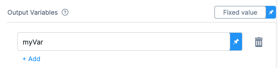
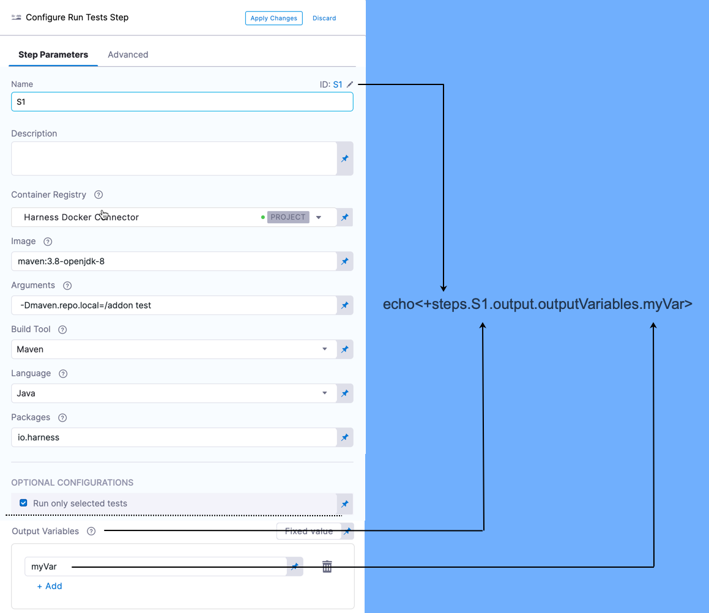

This topic provides settings and permissions for the Harness CI Run
step.

The Build stage **Run** step can be used to run scripts in your CI
stages.

The **Run** step pulls in a Docker image, like the Docker image for
Maven, and then you run a script with the tool, like
`mvn clean install`. You can use any Docker image from any public or
private Docker registry.

### Name

The unique name for this step.

### ID

See [Entity Identifier
Reference](https://docs.harness.io/article/li0my8tcz3-entity-identifier-reference).

### Description

Text string.

### Container Registry

The Harness Connector for a container registry. This is the container
registry for the image Harness will use run build commands on, such as
DockerHub.

### Image

The FQN (fully-qualified name) of the Docker image to use when running
build commands. For example:
`us.gcr.io/playground-123/quickstart-image`.

The image name should include the tag and will default to the latest tag
if unspecified. You can use any Docker image from any D registry,
including Docker images from private registries.

Different container registries require different name formats:

-   **Docker Registry:** enter the name of the artifact you want to
    deploy, such as **library/tomcat**. Wildcards are not supported.
-   **GCR:** enter the FQN (fully-qualified name) of the artifact you
    want to deploy. Images in repos need to reference a path, for
    example: **us.gcr.io/playground-123/quickstart-image:latest**.

-   **ECR:** enter the FQN (fully-qualified name) of the artifact you
    want to deploy. Images in repos need to reference a path, for
    example: **40000005317.dkr.ecr.us-east-1.amazonaws.com/todolist:0.2**.

### Commands

[POSIX](https://www.grymoire.com/Unix/Sh.html){target="_blank"} shell
script executed inside the container. In the Shell setting, you can
select **Bash** or **Shell**.

The script is invoked as if it were the container's entry point.

### Optional Configuration

Configure the following options to add additional configuration for the
Step.

#### Privileged

Enable this option to run the container with escalated privileges. This
is the equivalent of running a container with the
Docker `--privileged` flag.

#### Report Paths

The path to the file(s) that store results in the JUnit XML format.

Regex is supported.

::: note-callout
This variable must be set for the Step to publish test results.
:::

#### Environment Variables

Environment variables injected into the container and used in the script
in **Command**.

Enter a **Name** and **Value** for each variable.

You reference the environment variables in the script by their name,
just like in Bash ( `$var_name` or `${var_name}`) or Windows PowerShell
(`$Env:varName`).

For **Value**, you can enter [Fixed Values, Runtime Inputs, and
Expressions](https://docs.harness.io/article/f6yobn7iq0-runtime-inputs).

For example, you can set **Value** as an expression and reference the
value of some other setting in the Stage or Pipeline.

See [Built-in Harness Variables
Reference](https://docs.harness.io/article/lml71vhsim-harness-variables).

#### Output Variables

Output variables expose Environment Variables for use by other
steps/stages of the Pipeline.

You reference the output variable of a step using the step ID and the
name of the variable in Output Variables.

Let\'s look at a simple example.

In the **Command** in a step, export a new variable using the following
syntax:

    export myVar=varValue

In the **Output Variables**, list the exported variable name:

In a later **Run** step, in **Command**, reference the output variable:

    echo <+steps.S1.output.outputVariables.myVar>

Here\'s how the S1 step\'s output variable is referenced:

{style="max-height:50%;max-width:50%"
hd-height="50%" hd-width="50%"}

Syntax for referencing output variables between steps in the same stage:

`<+[stepID].output.outputVariables.[varName]>`

Syntax for referencing output variables between steps in different
stages:

`<+stages.[stageID].execution.steps.[stepID].output.outputVariables.[varName]>`

::: note-callout
The subsequent build job fails when exit 0 is present along with output
variables.
:::

#### Image Pull Policy

Select an option to set the pull policy for the image.

-   **Always**: the kubelet queries the container image registry to
    resolve the name to an image digest every time the kubelet launches
    a container. If the kubelet encounters an exact digest cached
    locally, it uses its cached image; otherwise, the kubelet downloads
    (pulls) the image with the resolved digest, and uses that image to
    launch the container.
-   **If Not Present**: the image is pulled only if it is not already
    present locally.
-   **Never**: the image is assumed to exist locally. No attempt is made
    to pull the image.

#### Shell

Select the shell script. If a Run Step includes commands that aren't
supported for the selected shell type, the build will fail.

You can run PowerShell Core (pwsh) commands in pods or containers that
have pwsh installed. You can run PowerShell commands on Windows VMs
running in AWS build farms.

#### Run as User

Set the value to specify the user id for all processes in the pod,
running in containers. See [Set the security context for a
pod](https://kubernetes.io/docs/tasks/configure-pod-container/security-context/#set-the-security-context-for-a-pod).

#### Set container resources

Maximum resources limit values for the resources used by the container
at runtime.

##### Limit Memory

Maximum memory that the container can use. You can express memory as a
plain integer or as a fixed-point number using the suffixes `G` or `M`.
You can also use the power-of-two equivalents `Gi` and `Mi`.

##### Limit CPU {#undefined}

The maximum number of cores that the container can use. CPU limits are
measured in cpu units. Fractional requests are allowed: you can specify
one hundred millicpu as `0.1` or `100m`. See [Resource units in
Kubernetes](https://kubernetes.io/docs/concepts/configuration/manage-resources-containers/#resource-units-in-kubernetes){target="_blank"}.

##### Timeout

Timeout for the step. Once the timeout is reached, the step fails, and
the Pipeline execution continues.

### See Also

-   [Step Skip Condition
    Settings](https://docs.harness.io/article/i36ibenkq2-step-skip-condition-settings)
-   [Step Failure Strategy
    Settings](https://docs.harness.io/article/htrur23poj-step-failure-strategy-settings)
