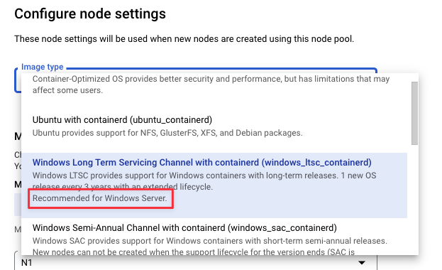

You can run Windows builds in your Kubernetes build infrastructure.
Windows Server 2019 images are available for running CI Builds and for
out-of-the-box Ci Steps such as Run, Run Step, Save, and Restore.

### Important Notes

-   You can\'t run Steps that build and push to Docker registries,
    because Kaniko is not supported on Windows.

-   You can't run Docker-in-Docker using a Windows image, because
    privileged mode is not supported on Windows.

-   Only Windows Server 2019 images are supported. If you are using
    Google Kubernetes Engine, make sure you use the recommended image
    type for Windows Server 2019.

    {style="display:block;margin-left:0;margin-right:auto"
    hd-align="left"}

-   If you use a custom Windows image in a Run Step, the container must
    be based on [Windows Server
    Core](https://hub.docker.com/_/microsoft-windows-servercore) version
    1809 and must include `netapi32.dll`. To include this in your image,
    add the following command to the Dockerfile:

        COPY --from=core /windows/system32/netapi32.dll /windows/system32/netapi32.dll

### Run the Windows Build

1.  Set up your cluster with both Linux and Windows node pools. Linux is
    required for running the Delegate.
2.  Set up the Build Stage in your Pipeline. Go to the Infrastructure
    tab and set the following options:
    1.  **OS** = **Windows**

    2.  Under **Advanced**, set the Node Selector to use the Windows
        node pool. Enter the following key/value pair:\
        **kubernetes.io/os** = **windows**

        {style="max-height:50%;max-width:50%;display:block;margin-left:0;margin-right:auto"
        hd-height="50%" hd-width="50%" hd-align="left"}
3.  Run the CI build.

### YAML Example

The following Pipeline definition provides a simple example for setting
up a Pipeline to run Windows builds.

Details

<div>

``` {.hljs .yaml}
pipeline:
  name: WindowsK8
  identifier: WindowsK8
  projectIdentifier: myproject
  orgIdentifier: default
  tags: {}
  properties:
    ci:
      codebase:
        connectorRef: $GITHUB_CONNECTOR
        repoName: testing-flask-with-pytest
        build: <+input>
  stages:
    - stage:
        name: Build and Test
        identifier: Build_and_Test
        type: CI
        spec:
          cloneCodebase: true
          infrastructure:
            type: KubernetesDirect
            spec:
              connectorRef: $K8S_CONNECTOR
              namespace: harness-delegate-ng
              automountServiceAccountToken: true
              nodeSelector:
                kubernetes.io/os: windows
              os: Windows
          execution:
            steps:
              - step:
                  type: Run
                  name: helloWorld
                  identifier: Pre
                  spec:
                    connectorRef: $DOCKERHUB_CONNECTOR
                    image: winamd64/python
                    shell: Powershell
                    command: "Write-Host \"hello world\" "
```

</div>
