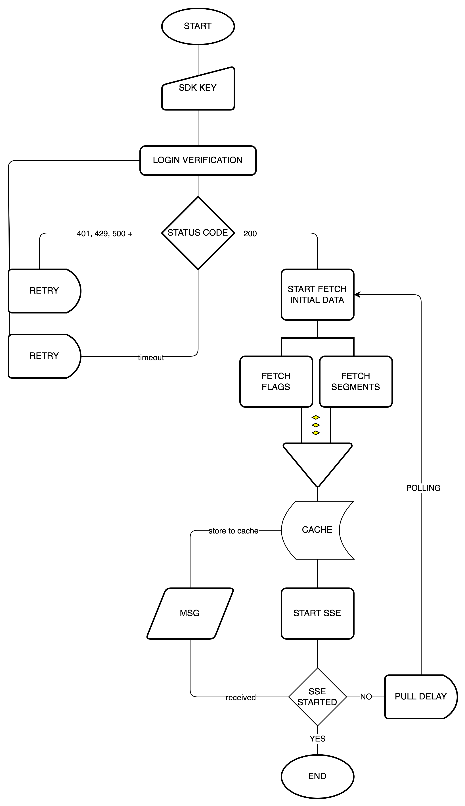

Harness Feature Flag provides several SDKs in different languages to
help you access feature flags from your applications. The SDKs are
divided into two main categories, regardless of the programming
language:

-   Client-side SDKs
-   Server-side SDKs

The client and server-side SDKs have different security considerations
as well as some behavioral and architectural differences. This topic
will help you understand the difference between Harness Feature Flag\'s
client-side and server-side SDKs.

### SDK architecture

Diagram of the SDK architecture

{style="max-height:50%;max-width:50%"
hd-height="50%" hd-width="50%"}

The above diagram defines the behavior of a SDK. It covers various
aspects like what happens at the beginning (initialization and
authentication) followed by behavior of an SDK during normal operation.

-   **SDK Initialization:** SDK initialization requires only one
    argument- SDK key and the optional configuration argument. There is
    a default configuration in the SDK and based on that configuration,
    an API client, a repository and an evaluator are set up.
-   **SDK Authentication:** Authentication is the first step in the
    development of the SDK. Without authentication, the evaluation
    function will return only the default values. To successfully log in
    to the system, use the SDK key. The key for client-side SDK cannot
    be used in the server-side SDK and vice versa. In order to log in
    successfully, a request is sent with SDK key. In case of client-side
    SDK key, add a target.

After successful login to the Feature Flag server using one of the two
types of keys, the other processors like **Poll Processor, Analytics
Processor and Stream Processor** start.

-   **Poll Processor:** Poll Processor fetches initial data from the
    Feature Flag server. Data such as details on feature flags and
    target groups is required during implementation. Poll Processor
    waits for both threads to complete. It ends one cycle in data
    retrieval and sets a delay in the duration of the value defined in
    the configuration. Each thread (one for flags and one for target
    groups) after a successful data retrieval from the Feature Flag
    server are saved to the repository.
-   **Stream Processor:** Stream Processor runs real time updates. This
    processor runs after successful fetching of data. It is a
    unidirectional approach where data is sent from the server to the
    client. When the processor completes its task, it immediately runs a
    thread that fetches new data in the background and stores it in a
    repository.
-   **Analytics/Update Processor:** Update Processor returns the data
    after evaluations. Once the data is fetched, this processor analyses
    the data with certain metrics; like flag evaluations, target events,
    and sends the data back.

### SDK Types

The following table lists the differences between the client-side and
server-side SDKs with respect to type of users, security, storage,
connection state, and operation.

+-----------------------+-----------------------+-----------------------+
| **Parameter**         | **Client Side SDK**   | **Server Side SDK**   |
+-----------------------+-----------------------+-----------------------+
| **Users**             | Designed to be used   | Designed to be used   |
|                       | in applications, your | in server-side        |
|                       | users run directly on | applications such as  |
|                       | their own devices,    | web servers and       |
|                       | such as mobile,       | backend services.     |
|                       | desktop, and web      |                       |
|                       | applications.         | Optimized to be used  |
|                       |                       | in multi-user and     |
|                       | Optimized to be used  | secure environments.  |
|                       | by a single user and  |                       |
|                       | low bandwidth         | Examples, Java, Go,   |
|                       | consumption.          | and Python SDKs.      |
|                       |                       |                       |
|                       | Examples: JavaScript, |                       |
|                       | iOS, Android, React   |                       |
|                       | Native SDKs.          |                       |
|                       |                       |                       |
|                       |                       |                       |
+-----------------------+-----------------------+-----------------------+
| **Security**          | The SDKs are embedded | The SDKs are embedded |
|                       | in your applications  | in applications that  |
|                       | and run on the        | run on your servers   |
|                       | browser or on mobile  | such as web servers   |
|                       | devices. Because of   | or backend servers.   |
|                       | which these SDKs can  | These environments    |
|                       | be compromised by     | are comparatively     |
|                       | users when unpacking  | safe.                 |
|                       | a mobile app or using |                       |
|                       | the browser\'s        | Server-side SDKs      |
|                       | developer tools to    | download all the      |
|                       | inspect the page. You | feature flags that    |
|                       | should not use a      | you have defined in a |
|                       | server-side SDK key   | project and store     |
|                       | in client-side        | them in memory.       |
|                       | applications.         |                       |
|                       |                       |                       |
|                       | Client-side SDKs only |                       |
|                       | perform an evaluation |                       |
|                       | of a flag and receive |                       |
|                       | the result.  They     |                       |
|                       | don\'t store all data |                       |
|                       | about a flag.         |                       |
+-----------------------+-----------------------+-----------------------+
| **Storage**           | Client-side SDK has a | Server-side SDKs      |
|                       | local cache. It       | downloads and caches  |
|                       | communicates with     | all flag rules and    |
|                       | Harness more often    | states and avoids     |
|                       |                       | most Harness          |
|                       |                       | communication         |
+-----------------------+-----------------------+-----------------------+
| **Connection state**  | Client-side SDKs      | Server-side SDKs can  |
|                       | require a consistent  | make an evaluation    |
|                       | connection to         | decision based on     |
|                       | establish an          | locally stored rules  |
|                       | evaluation decision.  | once instantiated. It |
|                       |                       | requires a connection |
|                       |                       | to pull or receive    |
|                       |                       | updates               |
+-----------------------+-----------------------+-----------------------+
| **Operation**         | Feature evaluation    | Server SDKs sync Flag |
|                       | happens on the        | rulesets in the       |
|                       | server-side, and SDK  | background and keep   |
|                       | only gets the         | in-memory cache. When |
|                       | evaluated results of  | an application makes  |
|                       | the Flags.            | the call for Flag     |
|                       |                       | value, the evaluation |
|                       |                       | happens locally, and  |
|                       |                       | no network call is    |
|                       |                       | made. Hence it is     |
|                       |                       | very fast and         |
|                       |                       | efficient.            |
+-----------------------+-----------------------+-----------------------+

### Supported application types

  ------------------------------------------------------------------------------------- -----------------------------------------------------------------------------------
  **Client-Side SDKs**                                                                  **Server-Side SDKs**
  [JavaScript](../client-sdks/java-script-sdk-references.md){target="_blank"}         [Java](../server-sdks/integrate-feature-flag-with-java-sdk.md){target="_blank"}
  [iOS](../client-sdks/ios-sdk-reference.md){target="_blank"}                         [Go](../server-sdks/feature-flag-sdks-go-application.md){target="_blank"}
  [Android](../client-sdks/android-sdk-reference.md){target="_blank"}                 [.NET](../server-sdks/net-sdk-reference.md){target="_blank"}
  [Flutter](../client-sdks/flutter-sdk-reference.md){target="_blank"}                 [Python](../server-sdks/python-sdk-reference.md){target="_blank"}
  [React Native](../client-sdks/react-native-sdk-reference.md){target="_blank"}       [Node.js](../server-sdks/node-js-sdk-reference.md){target="_blank"}
  [Xamarin SDK Reference](../client-sdks/xamarin-sdk-reference.md){target="_blank"}   [Ruby SDK Reference](../server-sdks/ruby-sdk-reference.md){target="_blank"}
                                                                                        [PHP](../server-sdks/php-sdk-reference.md){target="_blank"}
  ------------------------------------------------------------------------------------- -----------------------------------------------------------------------------------
