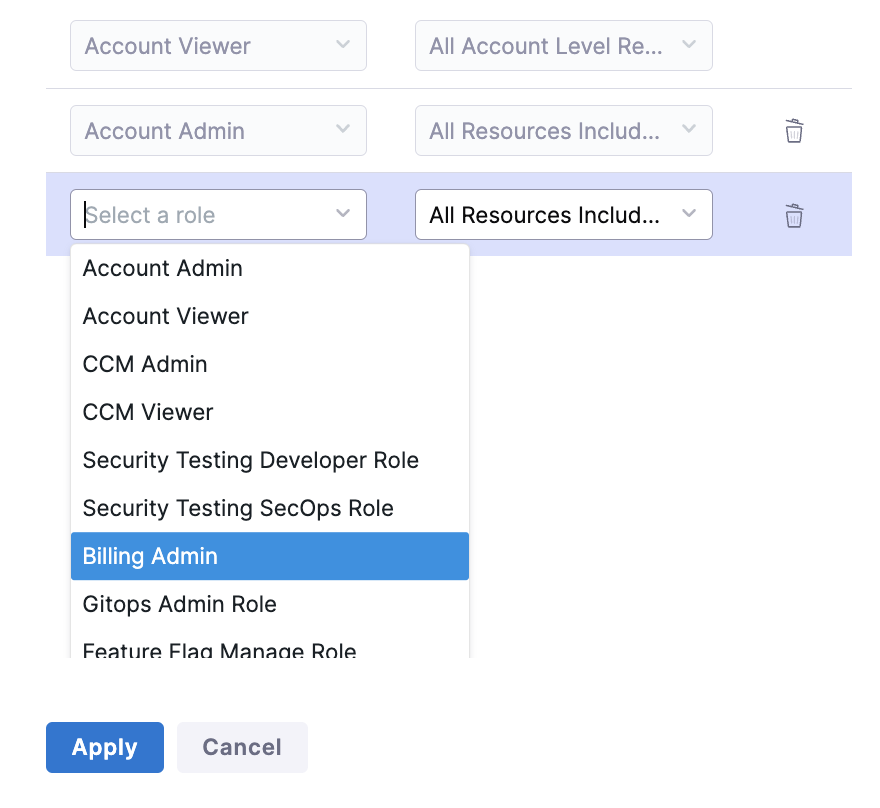

Billing Admins can manage payments on the Harness Platform. To add a
Billing Admin, use our [Role Based Access
Control](https://docs.harness.io/article/hyoe7qcaz6-add-users){target="_blank"} and add the
user with a role of **Billing Admin**.

{style="max-height:30%;max-width:30%"
hd-height="30%" hd-width="30%"}

*Figure 1: Selecting the Billing Admin role*
